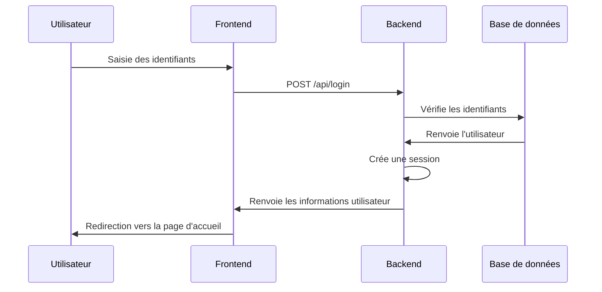
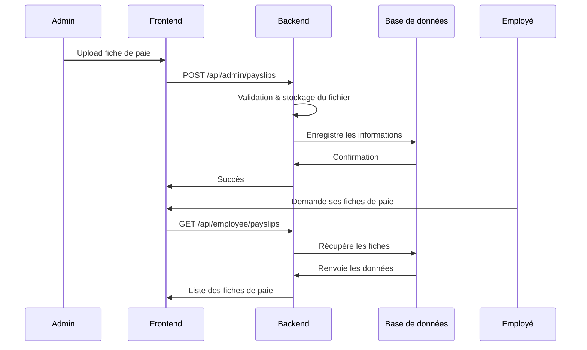
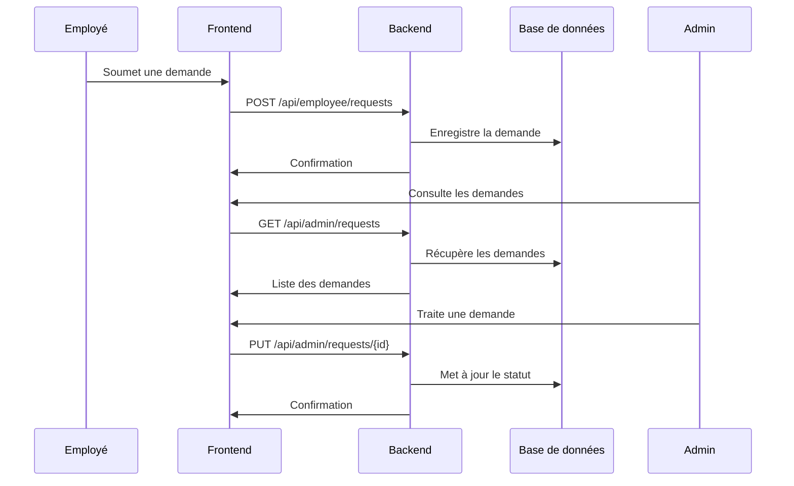

# SirteRH - Architecture Technique et Documentation du Projet

## Présentation du Projet

SirteRH est un système complet de gestion des ressources humaines développé pour l'Agence Nationale de Promotion et de Développement des Parcs Technologiques (ANPT). Cette application a été conçue pour simplifier et automatiser les processus RH, notamment la gestion des fiches de paie, des documents administratifs, des événements d'entreprise, et des demandes des employés.

Le projet a récemment fait l'objet d'une migration technique, passant d'un backend serverless basé sur Hono vers une architecture plus robuste utilisant Laravel et PostgreSQL, tout en conservant l'interface utilisateur React existante.

## Architecture Globale

SirteRH adopte une architecture moderne de type client-serveur avec une séparation claire entre le frontend et le backend:

```
SirteRH
│
├── Frontend (React)
│   ├── Interface utilisateur
│   └── Logique de présentation
│
└── Backend (Laravel + PostgreSQL)
    ├── API RESTful
    ├── Logique métier
    └── Persistance des données
```

### Communication Frontend-Backend

La communication entre le frontend et le backend s'effectue exclusivement via des API RESTful. Toutes les requêtes sont authentifiées via un système de sessions sécurisées, avec vérification des rôles pour garantir que les utilisateurs n'accèdent qu'aux ressources autorisées.

## Fonctionnalités Complètes de la Plateforme

SirteRH offre un ensemble complet de fonctionnalités divisées en deux interfaces principales : l'interface administrateur et l'interface employé.

### 1. Gestion des Utilisateurs

#### Fonctionnalités Administrateur
- **Création d'utilisateurs** : Enregistrement des nouveaux employés avec informations personnelles et professionnelles
- **Gestion des comptes** : Activation/désactivation des comptes utilisateurs
- **Attribution des rôles** : Définition des droits d'accès (administrateur ou employé)
- **Gestion des mots de passe** : Traitement des demandes de réinitialisation de mot de passe
- **Consultation des journaux de connexion** : Suivi des accès à la plateforme

#### Logique Métier
- Génération automatique des identifiants employés
- Hachage sécurisé des mots de passe
- Journalisation des tentatives de connexion réussies et échouées
- Vérification des adresses email pour la réinitialisation des mots de passe
- Validation des données utilisateur selon les règles métier de l'ANPT

### 2. Gestion des Fiches de Paie

#### Fonctionnalités Administrateur
- **Téléversement de fiches de paie** : Upload des fiches mensuelles pour chaque employé
- **Organisation par période** : Classement par mois et année
- **Gestion des accès** : Contrôle de la visibilité des fiches par employé

#### Fonctionnalités Employé
- **Consultation des fiches de paie** : Accès aux fiches personnelles
- **Téléchargement** : Possibilité de sauvegarder les fiches au format PDF
- **Historique** : Visualisation de l'historique complet des fiches

#### Logique Métier
- Validation du format des fichiers (PDF uniquement)
- Restriction de l'accès aux fiches (un employé ne peut voir que ses propres fiches)
- Organisation hiérarchique des documents par année et mois
- Notification automatique lors de la disponibilité d'une nouvelle fiche

### 3. Gestion des Chartes Salariales

#### Fonctionnalités Administrateur
- **Publication des grilles de salaires** : Mise en ligne des documents officiels
- **Archivage des versions** : Conservation de l'historique des grilles
- **Activation/désactivation** : Contrôle de la visibilité des chartes

#### Fonctionnalités Employé
- **Consultation** : Accès à la grille salariale en vigueur
- **Compréhension** : Explication du positionnement individuel dans la grille

#### Logique Métier
- Maintien d'une seule charte active à la fois
- Archivage automatique des versions précédentes
- Traçabilité des modifications et de l'auteur des mises à jour

### 4. Gestion des Événements d'Entreprise

#### Fonctionnalités Administrateur
- **Création d'événements** : Enregistrement des activités d'entreprise avec date, lieu et description
- **Modification/suppression** : Gestion du cycle de vie des événements
- **Notification** : Communication aux employés

#### Fonctionnalités Employé
- **Consultation du calendrier** : Vue des événements à venir
- **Détails des événements** : Accès aux informations complètes

#### Logique Métier
- Tri chronologique des événements
- Filtrage des événements actifs/inactifs
- Affichage différencié selon la proximité temporelle
- Mise en évidence des événements importants

### 5. Gestion des Annonces

#### Fonctionnalités Administrateur
- **Publication d'annonces** : Diffusion d'informations importantes
- **Définition de priorités** : Classification par niveau d'importance
- **Gestion du cycle de vie** : Activation/désactivation des annonces

#### Fonctionnalités Employé
- **Consultation des annonces** : Accès aux communications officielles
- **Notifications** : Réception des informations importantes

#### Logique Métier
- Tri des annonces par priorité et date
- Système de notification différencié selon la priorité
- Archivage automatique des anciennes annonces
- Traçabilité des annonces et de leur auteur

### 6. Gestion des Documents Administratifs

#### Fonctionnalités Administrateur
- **Classification documentaire** : Organisation par type de document
- **Upload de documents** : Mise à disposition des formulaires et procédures
- **Contrôle d'accès** : Gestion de la visibilité des documents

#### Fonctionnalités Employé
- **Recherche documentaire** : Filtrage par type ou mots-clés
- **Consultation et téléchargement** : Accès aux documents nécessaires

#### Logique Métier
- Catégorisation automatique des documents
- Indexation du contenu pour faciliter la recherche
- Traçabilité des consultations
- Mise à jour avec préservation des versions antérieures

### 7. Gestion des Requêtes Employés

#### Fonctionnalités Employé
- **Soumission de demandes** : Création de requêtes diverses (congés, attestations, etc.)
- **Suivi de statut** : Visualisation de l'état de traitement
- **Historique** : Accès aux demandes passées et leurs résolutions

#### Fonctionnalités Administrateur
- **Tableau de bord des requêtes** : Vue d'ensemble des demandes en attente
- **Traitement des demandes** : Approbation, rejet ou demande d'information
- **Communication** : Réponse aux employés

#### Logique Métier
- Acheminement automatique des demandes aux administrateurs
- Notification des changements de statut
- Classification des demandes par type et urgence
- Analyse statistique des délais de traitement

## Logique Métier Détaillée

### Système d'Authentification et de Sessions

Le système d'authentification de SirteRH repose sur les principes suivants:

1. **Authentification à deux niveaux** :
   - Vérification des identifiants (login/mot de passe)
   - Vérification du statut du compte (actif/inactif)

2. **Gestion de session sécurisée** :
   - Utilisation des sessions Laravel avec chiffrement
   - Expiration automatique après période d'inactivité
   - Invalidation lors de la déconnexion

3. **Journalisation de sécurité** :
   - Enregistrement de chaque tentative de connexion
   - Stockage des métadonnées (IP, User-Agent)
   - Détection des tentatives multiples échouées

### Règles de Gestion des Documents

La gestion documentaire suit ces règles métier :

1. **Cycle de vie des documents** :
   - Création : Téléversement avec métadonnées
   - Activation : Mise à disposition des utilisateurs
   - Archivage : Conservation hors accès standard
   - Suppression : Uniquement par administrateur

2. **Nommage et Classement** :
   - Convention de nommage standardisée pour les fichiers
   - Classification hiérarchique par type et sous-type
   - Métadonnées pour faciliter la recherche et le filtrage

3. **Contrôle d'accès granulaire** :
   - Fiches de paie : Accès restreint à l'employé concerné et aux administrateurs
   - Documents administratifs : Accès selon classification de confidentialité
   - Chartes salariales : Accès général mais publication contrôlée

### Workflow de Traitement des Demandes

Le processus de gestion des demandes suit ce flux :

1. **Soumission** :
   - L'employé crée une demande avec type, titre et description
   - Le système enregistre la date de soumission et attribue un identifiant unique
   - Statut initial : "En attente"

2. **Traitement** :
   - L'administrateur reçoit notification des nouvelles demandes
   - Possibilité de changer le statut : "En cours", "Approuvée", "Rejetée"
   - Ajout d'une réponse/justification obligatoire pour les rejets

3. **Finalisation** :
   - Notification à l'employé du changement de statut
   - Archivage dans l'historique personnel de l'employé
   - Possibilité de référencer des demandes antérieures

4. **Analyse** :
   - Calcul automatique des temps de traitement
   - Statistiques par type de demande et taux d'approbation
   - Rapports disponibles pour l'équipe RH

### Système de Notifications

La plateforme intègre un système de notification structuré :

1. **Types de notifications** :
   - Informationnelles : Nouvelles annonces, événements
   - Actionnables : Demandes à traiter, documents à consulter
   - Alertes : Changements importants nécessitant attention

2. **Canaux de diffusion** :
   - Notifications in-app via interface utilisateur
   - Emails pour les informations critiques (en option)
   - Rappels pour les éléments non consultés

3. **Prioritisation** :
   - Haute : Actions requises, délais courts
   - Moyenne : Informations importantes
   - Basse : Communications générales

## Architecture Frontend

Le frontend de SirteRH est développé avec React, une bibliothèque JavaScript pour la construction d'interfaces utilisateur. Il est organisé selon une structure modulaire qui facilite la maintenance et l'évolution de l'application.

### Structure des Répertoires Frontend

```
frontend/
├── public/             # Assets statiques et index.html
├── src/                # Code source React
│   ├── components/     # Composants UI réutilisables
│   │   ├── common/     # Composants génériques (boutons, formulaires, etc.)
│   │   ├── admin/      # Composants spécifiques à l'interface administrateur
│   │   └── employee/   # Composants spécifiques à l'interface employé
│   ├── pages/          # Pages principales de l'application
│   │   ├── Login/      # Page de connexion
│   │   ├── Admin/      # Pages d'administration
│   │   └── Employee/   # Pages destinées aux employés
│   ├── services/       # Services pour la communication avec l'API
│   ├── utils/          # Utilitaires et fonctions helpers
│   ├── context/        # Contextes React pour la gestion d'état globale
│   ├── hooks/          # Hooks personnalisés
│   ├── routes/         # Configuration du routage
│   ├── App.tsx         # Composant racine de l'application
│   └── index.tsx       # Point d'entrée de l'application
└── package.json        # Dépendances et scripts
```

### Bibliothèques et Technologies Frontend

- **React**: Bibliothèque UI pour la construction des interfaces
- **React Router**: Gestion du routage côté client
- **Axios**: Client HTTP pour les requêtes API
- **TypeScript**: Typage statique pour améliorer la robustesse du code
- **TailwindCSS**: Framework CSS utilitaire pour le styling
- **React Context API**: Gestion de l'état global de l'application

## Architecture Backend

Le backend de SirteRH est développé avec Laravel, un framework PHP élégant et robuste. Il suit le modèle architectural MVC (Modèle-Vue-Contrôleur), permettant une séparation claire des responsabilités.

### Structure des Répertoires Backend

```
backend/
├── app/                    # Code principal de l'application
│   ├── Http/               
│   │   ├── Controllers/    # Contrôleurs API
│   │   └── Middleware/     # Middleware pour authentification et autorisation
│   ├── Models/             # Modèles Eloquent
│   └── Providers/          # Fournisseurs de services Laravel
├── config/                 # Configuration de l'application
├── database/              
│   ├── migrations/         # Migrations de base de données
│   └── seeders/            # Seeders pour les données initiales
├── routes/                
│   └── api.php             # Définition des routes API
├── storage/                # Stockage des fichiers
└── composer.json           # Dépendances PHP
```

### Composants Clés du Backend

#### 1. Modèles Eloquent

Les modèles représentent les tables de la base de données et encapsulent la logique d'accès aux données. SirteRH utilise les modèles suivants :

- **User**: Gère les utilisateurs (administrateurs et employés)
- **Payslip**: Gère les fiches de paie des employés
- **SalaryChart**: Représente les grilles de salaires
- **Event**: Gère les événements d'entreprise
- **Announcement**: Gère les annonces importantes
- **AdministrativeDocument**: Représente les documents administratifs
- **EmployeeRequest**: Gère les demandes des employés
- **ConnectionLog**: Journalise les tentatives de connexion
- **PasswordResetRequest**: Gère les demandes de réinitialisation de mot de passe

#### 2. Contrôleurs API

Les contrôleurs sont responsables du traitement des requêtes API et renvoient les réponses appropriées. Les principaux contrôleurs sont :

- **AuthController**: Gère l'authentification (login, logout, vérification de session)
- **AdminController**: Fournit les fonctionnalités d'administration
- **EmployeeController**: Gère les fonctionnalités destinées aux employés
- **ValidationController**: Valide les données des formulaires avant traitement

#### 3. Middleware

Le middleware filtre les requêtes HTTP entrantes :

- **AdminMiddleware**: Assure que seuls les administrateurs accèdent aux routes protégées
- **EmployeeMiddleware**: Vérifie que l'utilisateur est authentifié

#### 4. Routes API

Les routes définissent les endpoints de l'API et sont regroupées selon le niveau d'accès requis :

- Routes publiques: `/api/login`, `/api/logout`
- Routes admin: `/api/admin/*`
- Routes employé: `/api/employee/*`

## Interfaces Utilisateurs et Interactions

### Interface Administrateur

L'interface administrateur offre une vue complète de la gestion RH avec les sections suivantes:

1. **Tableau de bord**
   - Vue d'ensemble des statistiques clés
   - Alertes et notifications prioritaires
   - Raccourcis vers les actions fréquentes

2. **Gestion des Employés**
   - Liste complète avec filtres et recherche
   - Formulaire de création/modification
   - Indicateurs de statut et d'activité

3. **Documents et Communications**
   - Gestionnaire de documents administratifs
   - Éditeur d'annonces et de communications
   - Planificateur d'événements d'entreprise

4. **Gestion des Fiches de Paie**
   - Interface d'upload par lot ou individuel
   - Organisation par période et par employé
   - Statuts de distribution et consultation

5. **Requêtes et Demandes**
   - File d'attente des demandes à traiter
   - Historique des demandes traitées
   - Outils de réponse et de suivi

### Interface Employé

L'interface employé est conçue pour être intuitive et faciliter l'accès rapide aux informations personnelles:

1. **Tableau de bord Personnel**
   - Résumé des informations importantes
   - Notifications personnalisées
   - Raccourcis vers les fonctions principales

2. **Mes Documents**
   - Accès aux fiches de paie personnelles
   - Documents administratifs disponibles
   - Charte salariale en vigueur

3. **Vie d'Entreprise**
   - Calendrier des événements
   - Annonces et communications
   - Informations générales

4. **Mes Demandes**
   - Formulaire de soumission de nouvelles demandes
   - Suivi des demandes en cours
   - Historique des demandes passées

5. **Mon Profil**
   - Informations personnelles
   - Options de sécurité et confidentialité
   - Préférences de notification

## Base de Données

SirteRH utilise PostgreSQL comme système de gestion de base de données relationnelle, choisi pour sa robustesse, ses performances et sa conformité aux normes SQL.

### Schéma de Base de Données

```
+---------------+       +---------------+       +-------------------+
| Users         |       | Payslips      |       | EmployeeRequests  |
+---------------+       +---------------+       +-------------------+
| id            |<----->| user_id       |       | id                |
| email         |       | file_name     |       | user_id           |
| role          |       | file_url      |       | request_type      |
| first_name    |       | month         |       | title             |
| last_name     |       | year          |       | description       |
| employee_id   |       | uploaded_by   |       | request_data      |
| ...           |       +---------------+       | status            |
+---------------+                               | ...               |
       ^                                        +-------------------+
       |                                                 ^
       |                                                 |
       +-----------------------------<------------------+
       |
       |
+---------------+       +---------------+       +-------------------+
| Events        |       | Announcements |       | AdminDocuments    |
+---------------+       +---------------+       +-------------------+
| id            |       | id            |       | id                |
| title         |       | title         |       | title             |
| description   |       | content       |       | description       |
| event_date    |       | priority      |       | file_name         |
| location      |       | created_by    |       | file_url          |
| created_by    |       | is_active     |       | document_type     |
| is_active     |       +---------------+       | created_by        |
+---------------+                               +-------------------+

+---------------+       +-------------------+    +-------------------+
| SalaryCharts  |       | ConnectionLogs    |    | PasswordResetReq  |
+---------------+       +-------------------+    +-------------------+
| id            |       | id                |    | id                |
| title         |       | user_email        |    | user_email        |
| file_name     |       | ip_address        |    | requested_at      |
| file_url      |       | user_agent        |    | handled_by        |
| uploaded_by   |       | login_at          |    | handled_at        |
| is_active     |       | success           |    | status            |
+---------------+       +-------------------+    +-------------------+
```

## Sécurité

SirteRH met en œuvre plusieurs mesures de sécurité pour protéger les données sensibles :

### 1. Authentification et Autorisation

- **Sessions sécurisées**: Laravel gère automatiquement les sessions utilisateur
- **Contrôle d'accès basé sur les rôles**: Middleware dédié pour vérifier les autorisations
- **Protection contre la CSRF**: Jetons CSRF sur toutes les requêtes POST

### 2. Protection des Données

- **Hachage des mots de passe**: Utilisation du hachage bcrypt pour les mots de passe
- **Validation des données entrantes**: Toutes les entrées utilisateur sont validées
- **Protection contre les injections SQL**: Utilisation de l'ORM Eloquent

### 3. Journalisation

- Journalisation des tentatives de connexion (réussies et échouées)
- Traçabilité des actions administratives

## Déploiement

SirteRH peut être déployé de deux manières :

### 1. Déploiement Docker (Développement)

Un environnement Docker complet est configuré pour le développement, comprenant :

- Container PHP avec Laravel
- Container PostgreSQL
- Container Nginx comme serveur web
- Container Node.js pour le développement frontend

```
docker-compose.yml
├── app (PHP/Laravel)
├── webserver (Nginx)
├── db (PostgreSQL)
└── frontend (Node.js)
```

### 2. Déploiement VPS (Production)

Pour l'environnement de production, SirteRH peut être déployé sur un VPS avec :

- Nginx ou Apache comme serveur web
- PHP 8.1+ avec les extensions nécessaires
- PostgreSQL comme base de données
- Certificats SSL pour HTTPS (via Certbot/Let's Encrypt)

## Flux de Travail des Fonctionnalités Clés

### 1. Authentification



### 2. Gestion des Fiches de Paie



### 3. Traitement des Demandes Employés



## API Complète et Points d'Entrée

### Endpoints d'Authentification
```
POST   /api/login                    # Authentification utilisateur
GET    /api/users/me                 # Obtenir l'utilisateur connecté
GET    /api/logout                   # Déconnexion
POST   /api/employee/password-reset-request  # Demande de réinitialisation
```

### Endpoints Administrateur
```
# Gestion des employés
GET    /api/admin/employees          # Liste des employés
POST   /api/admin/employees          # Créer un employé

# Gestion des fiches de paie
POST   /api/admin/payslips           # Upload d'une fiche de paie

# Gestion des chartes salariales
POST   /api/admin/salary-charts      # Upload d'une charte salariale

# Sécurité et logs
GET    /api/admin/logs               # Journaux de connexion
GET    /api/admin/password-requests  # Demandes de réinitialisation

# Événements
GET    /api/admin/events             # Liste des événements
POST   /api/admin/events             # Créer un événement
PUT    /api/admin/events/{id}        # Modifier un événement
DELETE /api/admin/events/{id}        # Supprimer un événement

# Annonces
GET    /api/admin/announcements      # Liste des annonces
POST   /api/admin/announcements      # Créer une annonce
PUT    /api/admin/announcements/{id} # Modifier une annonce
DELETE /api/admin/announcements/{id} # Supprimer une annonce

# Documents administratifs
GET    /api/admin/documents          # Liste des documents
POST   /api/admin/documents          # Upload d'un document
PUT    /api/admin/documents/{id}     # Modifier un document
DELETE /api/admin/documents/{id}     # Supprimer un document

# Requêtes employés
GET    /api/admin/requests           # Liste des requêtes
PUT    /api/admin/requests/{id}      # Traiter une requête
```

### Endpoints Employé
```
# Profil et informations personnelles
GET    /api/employee/profile         # Profil de l'employé connecté

# Fiches de paie
GET    /api/employee/payslips        # Fiches de paie de l'employé

# Charte salariale
GET    /api/employee/salary-chart    # Charte salariale active

# Événements et annonces
GET    /api/employee/events          # Liste des événements actifs
GET    /api/employee/announcements   # Liste des annonces actives

# Documents administratifs
GET    /api/employee/documents       # Documents disponibles

# Requêtes
GET    /api/employee/requests        # Requêtes de l'employé
POST   /api/employee/requests        # Créer une nouvelle requête
```

## Performance et Optimisation

### Optimisation Backend

- **Cache de configuration**: `php artisan config:cache`
- **Cache de routes**: `php artisan route:cache`
- **Cache de vues**: `php artisan view:cache`
- **Indexes de base de données** sur les colonnes fréquemment utilisées

### Optimisation Frontend

- **Code-splitting**: Chargement à la demande des modules
- **Compression des assets statiques**
- **Utilisation de React.memo** pour éviter les rendus inutiles

## Monitoring et Journalisation

- **Logs système**: Stockés dans `storage/logs`
- **Logs de connexion**: Stockés dans la table `connection_logs`
- **Logs d'erreurs**: Configuration configurable dans `.env`

## Evolution et Maintenance

### Futures Améliorations Possibles

1. **Authentification à deux facteurs**: Renforcement de la sécurité de connexion
2. **API RESTful complète avec documentation Swagger**: Pour faciliter l'intégration avec d'autres systèmes
3. **Notifications en temps réel**: Utilisation de WebSockets pour les notifications
4. **Internationalisation**: Support multilingue pour l'interface utilisateur
5. **Système de rapports avancés**: Génération de rapports RH personnalisables

### Procédures de Maintenance

1. **Mises à jour de sécurité**: Vérification régulière des dépendances
2. **Sauvegardes de base de données**: Configuration de sauvegardes automatisées
3. **Monitoring de performances**: Mise en place d'outils comme New Relic ou Datadog

## Conclusion

SirteRH offre une solution complète et robuste pour la gestion des ressources humaines. L'architecture technique choisie permet:

- Une **séparation claire des responsabilités** entre frontend et backend
- Une **sécurité renforcée** pour protéger les données sensibles
- Une **flexibilité** permettant d'évoluer avec les besoins futurs
- Une **maintenabilité** facilitée par l'utilisation de frameworks modernes et bien documentés

Cette migration vers Laravel et PostgreSQL a permis d'améliorer significativement la robustesse, la sécurité et la scalabilité de l'application, tout en maintenant une compatibilité complète avec le frontend existant.